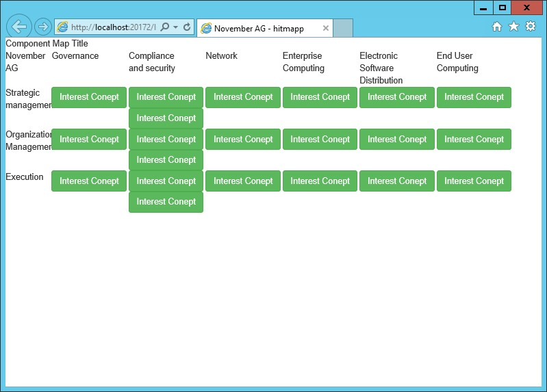
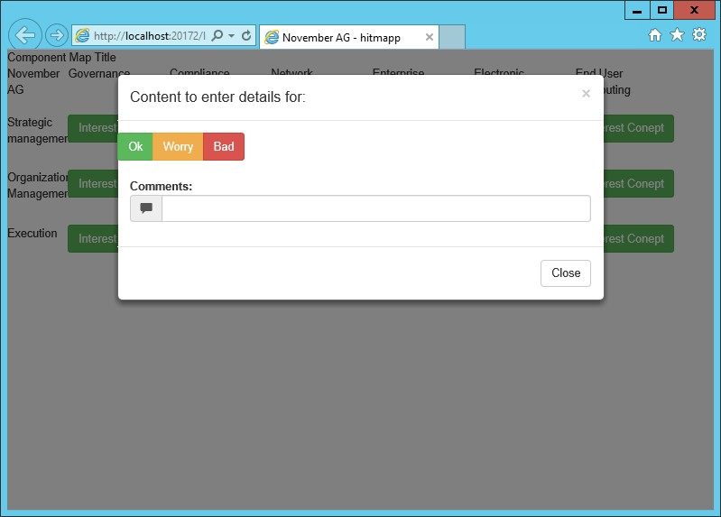

# November Strategy data collection tool
November Wire-frame for design of app collecting strategy meeting data
November AG already has an in-house developed application called [hitmapp](http://www.hitmapp.com/). This is dependend on a third party back-end, that dynamically produces the content and structure of the component maps.
The concepts displayed in this wireframe are placeholder only content needs to be dynamic.

##Wireframe only demonstrates end user specs
The behavior is like what a typical user now sees on their iPad only solution.
The site for [hitmapp](http://www.hitmapp.com/) shows an indepth usage scenario.

##Backend is reason for possible switch
Back end is technically owned by November, however is a great concept
Reason for moving away from here is a fixed license fee. To leverage cloud and perhaps a much more scaleable solution. 
Looking to host this in a cloud based on temporal assignment and availability.

##security
Security should be enabled by a short key-word which locks the unique token a client has collected.
All client data is now tied into the group, the user only needs to supply his name for validation against a known list.
Thought process is to have a identity assigned to first time user. 
The user then keys in his name and the group code.
This is validated on back-end, from that moment on the user is associated with the identity and identity key will be used going forward.
If identity is missing user will get a new identity.
Data is no longer associated, can be re-associated in reporting.

##configuration
Most visible data is dynamic edited by the November team and subject to change from one strategy session to the other.
The number of columns and their headers, the number of rows and their headers.
Each cros-section can have a number of components, each of which can be graded on 3 levels, and can get feedback.
The details of each component can be displayed on where detils are added. 
The list of meeting members and keywords can separate the different members of that team.
There needs to be a near real time monitoring feature displaying who entered what.

##HTML/ReactiveExtensions/Rest
I believe a light weight client over a secure channel with tiny real time updates to make sure the progress is monitored
The client needs to run in iPad iOS. I believe Xamarin forms or Cordova could be very viable products to deliver this.
Using Telerik kendo could be leveraged for a pure HTML solution. Limits are to a minimum screen width to allow for fidelity.
That is why only iPad is used so far the consumption is straight forward. 
Server side should ideally be a reactive extensions enabled REST API which can render results on a shared view in near real time.

##screenshots
Concept of the default screen:

Concept of the details entry screen:
